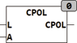

<!--
  Copyright (c) 2026 Hans Mühlbauer, Franz Höpfinger and others.

  This program and the accompanying materials are made available under the
  terms of the Eclipse Public License 2.0 which is available at
  https://www.eclipse.org/legal/epl-2.0

  SPDX-License-Identifier: EPL-2.0
-->

## Type	Funktion : [COMPLEX](../../Data Types/complex.md)

| | |
|:---|:---|
| **Input	L** | REAL (Länge oder Raduis) |
| **A** | REAL (Winkelwert) |
| **Output** | [COMPLEX](../../Data Types/complex.md) (Ergebnis) |
| | CPOL erzeugt eine Komplexe Zahl aus der Polarform. Die Eingangswerte L und A spezifizieren die Länge (Radius) und den Winkel. |

