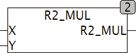

<!--
  Copyright (c) 2026 Hans Mühlbauer, Franz Höpfinger and others.

  This program and the accompanying materials are made available under the
  terms of the Eclipse Public License 2.0 which is available at
  https://www.eclipse.org/legal/epl-2.0

  SPDX-License-Identifier: EPL-2.0
-->

## R2_MUL

| | |
|:---|:---|
| **Type	Funktion** | [REAL2](../../Data Types/real2.md) |
| **Input	X** | [REAL2](../../Data Types/real2.md) (Eingangswert) |
| **Y** | REAL (Multiplikator) |
| **Output** | [REAL2](../../Data Types/real2.md) (Ergebnis mit Doppelter Genauigkeit) |
| | R2_MUL Multipliziert einen Wert Doppelter Genauigkeit X mit einem Wert einfacher Genauigkeit Y. Das Ergebnis hat wieder Doppelte Genauigkeit. |

