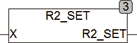

<!--
  Copyright (c) 2026 Hans Mühlbauer, Franz Höpfinger and others.

  This program and the accompanying materials are made available under the
  terms of the Eclipse Public License 2.0 which is available at
  https://www.eclipse.org/legal/epl-2.0

  SPDX-License-Identifier: EPL-2.0
-->

## R2_SET

| | |
|:---|:---|
| **Type	Funktion** | [REAL2](../../Data Types/real2.md) |
| **Input	X** | REAL (Eingangswert) |
| **Output** | [REAL2](../../Data Types/real2.md) (Ergebnis mit Doppelter Genauigkeit) |
| | R2_SET setzt einen Wert Doppelter Genauigkeit auf den Eingangswert X mit einfacher Genauigkeit. |

