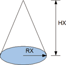

<!--
  Copyright (c) 2026 Hans Mühlbauer, Franz Höpfinger and others.

  This program and the accompanying materials are made available under the
  terms of the Eclipse Public License 2.0 which is available at
  https://www.eclipse.org/legal/epl-2.0

  SPDX-License-Identifier: EPL-2.0
-->

## Type	Funktion

| | |
|:---|:---|
| **Input	RX** | REAL (Kreisradius der Grundfläche) |
| **HX** | REAL (Höhe des Kegels) |
| **Output** | REAL (Volumen des Kegels) |
| | KONE_V berechnet das Volumen eines Kegels mit dem Radius RX und der Höhe HX. |

