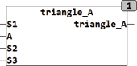

<!--
  Copyright (c) 2026 Hans Mühlbauer, Franz Höpfinger and others.

  This program and the accompanying materials are made available under the
  terms of the Eclipse Public License 2.0 which is available at
  https://www.eclipse.org/legal/epl-2.0

  SPDX-License-Identifier: EPL-2.0
-->

## Type	Funktion

| | |
|:---|:---|
| **Input	S1** | REAL (Seitenlänge 1) |
| **A** | REAL (Winkel zwischen Seite 1 und Seite 2) |
| **S2** | REAL (Seitenlänge 2) |
| **S3** | REAL (Seitenlänge 3) |
| **Output** | REAL (Fläche des Dreiecks) |
| | TRIANGLE_A berechnet die Fläche eines beliebigen Dreiecks. Das Dreieck kann wahlweise durch 2 Seiten und den durch die Seiten 1 und 2 aufgespannten Winkel (S1, S2 und A) definiert sein oder wenn A = 0 dann wird die Fläche aus den drei Seiten (S1, S2 und S3) berechnet. |

