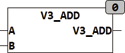

<!--
  Copyright (c) 2026 Hans Mühlbauer, Franz Höpfinger and others.

  This program and the accompanying materials are made available under the
  terms of the Eclipse Public License 2.0 which is available at
  https://www.eclipse.org/legal/epl-2.0

  SPDX-License-Identifier: EPL-2.0
-->

## Type	Funktion

| | |
|:---|:---|
| **Input	A** | [VECTOR_3](../../Data Types/vector_3.md) (Vektor mit den Koordinaten X, Y, Z) |
| **B** | [VECTOR_3](../../Data Types/vector_3.md) (Vektor mit den Koordinaten X, Y, Z) |
| **Output** | [VECTOR_3](../../Data Types/vector_3.md) (Vektor mit den Koordinaten X, Y, Z) |
| | V3_ADD addiert 2 dreidimensionale Vektoren. |
| | V3_ADD([3,4,5],[1,2,3]) = (4,6,8) |

