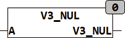

<!--
  Copyright (c) 2026 Hans Mühlbauer, Franz Höpfinger and others.

  This program and the accompanying materials are made available under the
  terms of the Eclipse Public License 2.0 which is available at
  https://www.eclipse.org/legal/epl-2.0

  SPDX-License-Identifier: EPL-2.0
-->

## Type	Funktion

| | |
|:---|:---|
| **Input	A** | [VECTOR_3](../../Data Types/vector_3.md) (Vektor mit den Koordinaten X, Y, Z) |
| **Output** | BOOL (TRUE wenn Vektor ein Nullvektor ist) |
| | V3_NUL prüft ob der Vektor A ein Nullvektor ist. Ein Vektor ist dann ein Nullvektor wenn alle Komponenten (X, Y, Z) gleich Null sind. |
| | V3_NUL(0,0,0) = TRUE |

