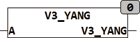

<!--
  Copyright (c) 2026 Hans Mühlbauer, Franz Höpfinger and others.

  This program and the accompanying materials are made available under the
  terms of the Eclipse Public License 2.0 which is available at
  https://www.eclipse.org/legal/epl-2.0

  SPDX-License-Identifier: EPL-2.0
-->

## Type	Funktion

| | |
|:---|:---|
| **Input	A** | [VECTOR_3](../../Data Types/vector_3.md) (Vektor mit den Koordinaten X, Y, Z) |
| **Output** | REAL (Winkel zur Y-Achse) |
| | V3_YANG berechnet den Winkel zwischen Der Y-Achse des Koordinatensystems und einem dreidimensionalen Vektor A in Bogenmaß |
| | V3_YANG(1,2,3) = 1.006.. |

