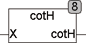

<!--
  Copyright (c) 2026 Hans Mühlbauer, Franz Höpfinger and others.

  This program and the accompanying materials are made available under the
  terms of the Eclipse Public License 2.0 which is available at
  https://www.eclipse.org/legal/epl-2.0

  SPDX-License-Identifier: EPL-2.0
-->

## COTH

| | |
|:---|:---|
| **Type	Funktion** | REAL |
| **Input	X** | REAL (Eingangswert) |
| **Output** | REAL (Ausgangswert) |
| **COTHBerechnet den Cotangens Hyperbolicus nach folgender Formel** |  |
| | für Eingangswerte größer 20 oder kleiner als -20 liefert COTH den Näherungswert +1 beziehungsweise -1 was einer Genauigkeit besser 8 Stellen entspricht und somit unterhalb der Auflösung des Typs REAL liegt. |

