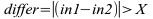

<!--
  Copyright (c) 2026 Hans Mühlbauer, Franz Höpfinger and others.

  This program and the accompanying materials are made available under the
  terms of the Eclipse Public License 2.0 which is available at
  https://www.eclipse.org/legal/epl-2.0

  SPDX-License-Identifier: EPL-2.0
-->

## DIFFER

| | |
|:---|:---|
| **Type	Funktion** | BOOL |
| **Input	IN1** | REAL (Wert 1) |
| **IN2** | REAL (Wert 2) |
| **X** | REAL (Mindestunterschied in1 zu in2) |
| **Output** | BOOL (TRUE, wenn sich in1 und in2 um mehr als x voneinander 	unterscheiden) |
| | Die Funktion DIFFER wird TRUE, wenn in1 und in2 sich durch mehr als X voneinander unterscheiden. |




**Beispiel:**

```iecst
Differ(100, 120, 10) ergibt TRUE Differ(100,110,15) ergibt FALSE
```
