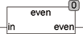

<!--
  Copyright (c) 2026 Hans Mühlbauer, Franz Höpfinger and others.

  This program and the accompanying materials are made available under the
  terms of the Eclipse Public License 2.0 which is available at
  https://www.eclipse.org/legal/epl-2.0

  SPDX-License-Identifier: EPL-2.0
-->

## Type	Funktion : BOOL

| | |
|:---|:---|
| **Input	in** | DINT (Eingangswert) |
| **Output** | BOOL (TRUE, wenn in gerade) |
| | Die Funktion EVEN wird TRUE, wenn der Eingang IN gerade ist und FALSE für ungerade IN. |



**Beispiel:**

```iecst
EVEN(2) ergibt TRUE EVEN(3) ergibt FALSE
```
