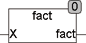

<!--
  Copyright (c) 2026 Hans Mühlbauer, Franz Höpfinger and others.

  This program and the accompanying materials are made available under the
  terms of the Eclipse Public License 2.0 which is available at
  https://www.eclipse.org/legal/epl-2.0

  SPDX-License-Identifier: EPL-2.0
-->

## Type	Funktion : DINT

| | |
|:---|:---|
| **Input	X** | INT (Eingangswert) |
| **Output** | DINT (Fakultät von X) |
| | Die Funktion FACT berechnet die Fakultät von X. |
| | Sie ist definiert für Eingangswerte von 0 .. 12. Für Werte kleiner Null und größer 12 wird das Ergebnis -1. für die Fakultät von größeren Zahlen ist die Funktion GAMMA geeignet. |
| **Für natürliche Zahlen X ist** | X! = 1*2*3...*(X-1)*X, 	0! = 1 |
| | Fakultäten für negative oder nicht ganze Zahlen sind nicht definiert. |



**Beispiel:**

```iecst
1! = 1 2! = 1*2 = 2 5! = 1*2*3*4*5 = 120
```
