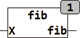

<!--
  Copyright (c) 2026 Hans Mühlbauer, Franz Höpfinger and others.

  This program and the accompanying materials are made available under the
  terms of the Eclipse Public License 2.0 which is available at
  https://www.eclipse.org/legal/epl-2.0

  SPDX-License-Identifier: EPL-2.0
-->

## Type	Funktion : DINT

| | |
|:---|:---|
| **Input	X** | INT (Eingangswert) |
| **Output** | DINT (Fibonacci Zahl) |
| **FIB berechnet die Fibonacci Zahl. Die Fibonacci Zahl ist wie folgt definiert** |  |
| | FIB(0) = 0, FIB(1) = 1, FIB(2) = 1, FIB(3) = 2, FIB(4) = 3, FIB(5) = 5 ..... |
| | Die Fibonacci Zahl von X ist gleich der Summe der Fibonacci Zahlen von X-1 und X-2. Die Funktion kann die Fibonacci Zahlen bis 46 berechnen, ist X < 0 oder Größer als 46 gibt die Funktion -1 zurück. |

