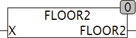

<!--
  Copyright (c) 2026 Hans Mühlbauer, Franz Höpfinger and others.

  This program and the accompanying materials are made available under the
  terms of the Eclipse Public License 2.0 which is available at
  https://www.eclipse.org/legal/epl-2.0

  SPDX-License-Identifier: EPL-2.0
-->

## Type	Funktion : DINT

| | |
|:---|:---|
| **Input	X** | REAL (Eingangswert) |
| **Output** | DINT (Ausgangswert) |
| | Die Funktion FLOOR2 gibt den größten ganzzahligen Wert kleiner gleich X zurück. |



**Beispiel:**

```iecst
FLOOR2(3.14) = 3 FLOOR2(-3.14) = -4 FLOOR2(2) = 2
```
