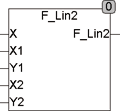

<!--
  Copyright (c) 2026 Hans Mühlbauer, Franz Höpfinger and others.

  This program and the accompanying materials are made available under the
  terms of the Eclipse Public License 2.0 which is available at
  https://www.eclipse.org/legal/epl-2.0

  SPDX-License-Identifier: EPL-2.0
-->

## Type	Funktion : REAL

| | |
|:---|:---|
| **Input	X** | REAL |
| **X1, Y1** | REAL (erste Koordinate) |
| **X2, Y2** | REAL (zweite Koordinate) |
| **Output** | REAL (Wert auf der Geraden, die durch die obigen 2 Punkte  	definiert ist.) |
| | Die Funktion F_LIN2 Berechnet den Y-Wert einer linearen Gleichung. |
| | Die Gerade ist dabei durch die Spezifikation zweier Koordinatenpunkte (X1,Y1; X2,Y2) definiert. |

