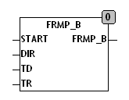

<!--
  Copyright (c) 2026 Hans Mühlbauer, Franz Höpfinger and others.

  This program and the accompanying materials are made available under the
  terms of the Eclipse Public License 2.0 which is available at
  https://www.eclipse.org/legal/epl-2.0

  SPDX-License-Identifier: EPL-2.0
-->

## FRMP_B

| | |
|:---|:---|
| **Type	Funktion** | BYTE |
| **Input	START** | BYTE (Startwert) |
| **DIR** | BOOL (Richtung der Rampe) |
| **TD** | TIME (Abgelaufene Zeit) |
| **TR** | TIME (Gesamtzeit für Rampe) |
| **Output** | BYTE (Ausgang) |
| | FRMP_B berechnet den Wert einer Rampe bei gegebenem Zeitablauf TD. Der Baustein stellt dabei sicher das kein Über- oder Unter-Lauf des Ausgangs stattfinden kann. Der Ausgangswert ist in allen Fällen auf 0 .. 255 begrenzt. TR gibt die Zeit für eine gesamte Rampe 0 .. 255 vor und TD ist die abgelaufene Zeit. Wenn DIR = TRUE wird eine steigende Rampe berechnet und wenn DIR = FALSE eine fallende Flanke. Mit den Startwert kann eine Flanke von einem beliebigen Startpunkt aus berechnet werden. |

