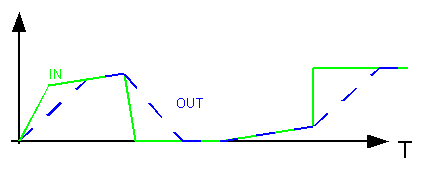

<!--
  Copyright (c) 2026 Hans Mühlbauer, Franz Höpfinger and others.

  This program and the accompanying materials are made available under the
  terms of the Eclipse Public License 2.0 which is available at
  https://www.eclipse.org/legal/epl-2.0

  SPDX-License-Identifier: EPL-2.0
-->

## Type	Funktionsbaustein

| | |
|:---|:---|
| **Input	RMP** | BOOL (Enable Signal) |
| **IN** | REAL (Eingangssignal) |
| **KR** | REAL (Geschwindigkeit des Anstiegs in 1 / Sekunden) |
| **KF** | REAL (Geschwindigkeit des Abfalls in 1 / Sekunden) |
| **Output	OUT** | REAL (Ausgangssignal) |
| **BUSY** | BOOL (Zeigt an ob Ausgang Steigt oder Fällt) |
| **UD** | BOOL (TRUE, wenn Ausgang steigt und FALSE, wenn  	Ausgang fällt) |
| | Der Ausgang OUT folgt dem Eingang mit einer linearen Rampe mit definierter Anstiegs- oder Abfall-Geschwindigkeit (KR und KF). K = 1 bedeutet, dass der Ausgang mit 1 Einheit pro Sekunde steigt oder fällt. Der K Faktor muss größer als 0 sein. Der Ausgang UD ist TRUE, wenn das Ausgangssignal steigt und FALSE, wenn es abfällt. Wenn der Ausgang den Eingangswert erreicht hat ist BUSY FALSE, ansonsten ist BUSY TRUE und zeigt an, dass eine steigende oder fallende Rampe aktiv ist. |
| | Das Ausgangssignal folgt solange dem Eingangssignal wie die Anstiegs- oder Abfall-Geschwindigkeit des Eingangssignals kleiner ist, als die durch KR und KF definierte maximale Anstiegs- oder Abfall-Geschwindigkeit. Verändert sich das Eingangssignal schneller, so läuft der Ausgang mit der Geschwindigkeit KR oder KF dem Eingangssignal hinterher. Die Rampenerzeugung ist Zeitecht, was bedeutet, dass FT_RMP zu jeder Ausführung berechnet wo der Ausgang stehen sollte und diesen Wert auf den Ausgang legt. Die Ausgangsveränderung ist also abhängig von der Zykluszeit und erfolgt nicht in gleichen Schritten. Wird eine Rampe aus lauter gleichen Schritten benötigt, so stehen die Bausteine RMP_B und RMP_W zur Verfügung. Der Baustein ist nur dann aktiv wenn der Eingang RMP = TRUE ist. |
| **Die folgende Grafik zeigt den Verlauf des Ausgangs in Abhängigkeit eines Eingangssignals** |  |

