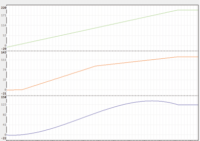

<!--
  Copyright (c) 2026 Hans Mühlbauer, Franz Höpfinger and others.

  This program and the accompanying materials are made available under the
  terms of the Eclipse Public License 2.0 which is available at
  https://www.eclipse.org/legal/epl-2.0

  SPDX-License-Identifier: EPL-2.0
-->

## POLYNOM_INT

| | |
|:---|:---|
| **Type** | Funktion |
| **Input	X** | REAL (Eingangssignal) |
| **XY** | ARRAY[1..5,0..1] (Aufsteigend sortierte Wertepaare) |
| **PTS** | INT (Anzahl der Wertepaare) |
| **Output** | REAL (Ausgangssignal) |
| | POLYNOM_INT interpoliert eine Anzahl von Wertepaaren mit einem Polynom N-fachen Grades. Die Anzahl der Wertepaare ist PTS und N entspricht der Anzahl der Wertepaare (PTS). Eine beliebige Kennlinie wird mit maximal 5 Koordinatenwerten (X,Y) beschrieben und intern mit einem Polynom beschrieben. Die Definition der Koordinatenwerte wird in einem Array übergeben welches die Kennlinie mit einzelnen X,Y Wertepaaren beschreibt. Die Wertepaare müssen aufsteigend nach dem X_Wert Sortiert sein. Wird ein X-Wert außerhalb des durch die Wertepaare beschriebenen Bereiches abgefragt, so wird dieser gemäß dem ermittelten Polygon berechnet, es ist hierbei aber zu beachten das durch ein Polynom höheren Grades Schwingungen oberhalb und unterhalb des Definitionsbereiches auftreten können und berechnete Werte in diesem Bereich meist nicht sinnvoll sind. Vor der Anwendung einer Polynominterpolation sind unbedingt Grundlagen hierzu, zum Beispiel in Wikipedia, nachzulesen. Um die Anzahl der Definitionspunkte flexibel zu halten wird am Eingang PTS die Anzahl der Punkte vorgegeben. Die mögliche Punktezahl liegt im Bereich 3 bis 5, wobei jeder Einzelpunkt mit X- und Y-Wert dargestellt ist. Ein Polynominterpolation mit mehr als 5 Punkten führt zu erhöhter Schwingneigung und ist aus diesem Grunde abzulehnen. |
| **Das folgende Beispiel zeigt die Definition für das Array XY und einige Werte** |  |
| | VAR |

**Beispiel:**

BEISPIEL : ARRAY[1..5,0..1] := -10,-0.53, 10,0.53, 100,88.3, 200,122.2; END_VAR für obige Definition ergeben sich folgende Ergebnisse: POLYNOM_INT(0, Beispiel, 4) = -1.397069; POLYNOM_INT(30.0, Beispiel, 4) = 11.4257; POLYNOM_INT(66.41, Beispiel, 4) = 47.74527; POLYNOM_INT(800.0, Beispiel, 4) = -19617.94; Bei den Ergebnissen im Beispiel ist deutlich zu erkennen das der Wert von -19617.94 für den Eingang X = 800 keinen Sinn macht, da er außerhalb des definierten Bereichs von -10 bis +200 liegt. Die folgende Trace Aufzeichnung zeigt den Verlauf des Ausgangs zum Eingang. Hierbei sind deutlich die Überschwinger des Polygons gegenüber einer linearen Interpolation zu erkennen. Grün = Eingang X, Rot = lineare Interpolation, Blau = Polynom Interpolation.
