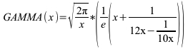

<!--
  Copyright (c) 2026 Hans Mühlbauer, Franz Höpfinger and others.

  This program and the accompanying materials are made available under the
  terms of the Eclipse Public License 2.0 which is available at
  https://www.eclipse.org/legal/epl-2.0

  SPDX-License-Identifier: EPL-2.0
-->

## GAMMA

| | |
|:---|:---|
| **Type	Funktion** | REAL |
| **Input	X** | REAL (Eingangswert) |
| **Output** | REAL (Gamma Funktion) |
| | Die Funktion GAMMA berechnet die Gamma Funktion nach der Näherungsformel von NEMES. |
| | Die Gamma Funktion kann für Ganzzahlige X als Ersatz für Die Fakultät verwendet werden. |

