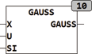
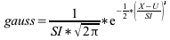

<!--
  Copyright (c) 2026 Hans Mühlbauer, Franz Höpfinger and others.

  This program and the accompanying materials are made available under the
  terms of the Eclipse Public License 2.0 which is available at
  https://www.eclipse.org/legal/epl-2.0

  SPDX-License-Identifier: EPL-2.0
-->

## GAUSS

| | |
|:---|:---|
| **Type	Funktion** | REAL |
| **Input	X** | REAL (Eingangswert) |
| **U** | REAL (Lokalität der Funktion) |
| **SI** | REAL (Sigma, Spreizung der Funktion) |
| **Output** | REAL (Gauss Funktion) |
| **Die Funktion GAUSS berechnet die Normalverteilung nach folgender Formel** |  |
| | Die Normalverteilung ist die Dichtefunktion Normalverteilter Zufallsgrößen. Mit den Parameter U = 0 und SI = 1 entspricht sie der Standard Normalverteilung. |

