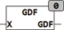

<!--
  Copyright (c) 2026 Hans Mühlbauer, Franz Höpfinger and others.

  This program and the accompanying materials are made available under the
  terms of the Eclipse Public License 2.0 which is available at
  https://www.eclipse.org/legal/epl-2.0

  SPDX-License-Identifier: EPL-2.0
-->

## GDF

| | |
|:---|:---|
| **Type	Funktion** | REAL |
| **Input	X** | REAL (Eingangswert) |
| **Output** | REAL (Gundermannfunktion) |
| | GDF berechnet die Gundermannfunktion. |
| **Die Berechnung erfolgt nach der Formel** |  |
| | Das Ergebnis von GDF liegt zwischen -π/2 und +π/2. |
| | GDF(0) = 0 |

