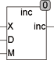

<!--
  Copyright (c) 2026 Hans Mühlbauer, Franz Höpfinger and others.

  This program and the accompanying materials are made available under the
  terms of the Eclipse Public License 2.0 which is available at
  https://www.eclipse.org/legal/epl-2.0

  SPDX-License-Identifier: EPL-2.0
-->

## Type	Funktion : INT

| | |
|:---|:---|
| **Input	X** | INT (Eingangswert) |
| **D** | INT (Wert, der zum Eingangswert addiert wird) |
| **M** | INT (Maximalwert für den Ausgang) |
| **Output** | INT (Ausgangswert) |
| | INC addiert zum Eingang X den Wert D und stellt sicher, dass der Ausgang INC nicht über den Wert M läuft. Ist das Ergebnis aus der Addition von X und D größer als M so wird wieder bei 0 begonnen. Die Funktion ist vor allem Sinnvoll beim adressieren von Arrays und Pufferspeichern. Auch beim Positionieren von Absolutwert Winkelgebern kann sie eingesetzt werden. INC kann auch mit einem negativen D zum decrementieren benutzt werden, dabei stellt INC sicher dass das Ergebnis nicht unter Null läuft. Wird von Null eins abgezogen beginnt INC wieder bei M. |
| **INC** | = X + D, weil D maximal den Wert M annehmen kann. |
| | Wird INC > M so beginnt INC wieder bei 0. |
| | Wird INC < 0 so beginnt INC wieder bei M |



**Beispiel:**

```iecst
INC(3, 2, 5) ergibt 5 INC(4, 2, 5) ergibt 0 INC(0,-1,7) ergibt 7
```
