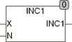

<!--
  Copyright (c) 2026 Hans Mühlbauer, Franz Höpfinger and others.

  This program and the accompanying materials are made available under the
  terms of the Eclipse Public License 2.0 which is available at
  https://www.eclipse.org/legal/epl-2.0

  SPDX-License-Identifier: EPL-2.0
-->

## Type	Funktion : INT

| | |
|:---|:---|
| **Input	X** | INT ( Anzahl der Werte die X einnehmen kann) |
| **N** | INT (Variable die Hochgezählt wird) |
| **Output** | INT (Rückgabewert) |
| | INC1 zählt die Variable X von 0 .. N-1 und beginnt dann wieder bei 0, so dass genau N verschiedene Werte beginnend bei 0 erzeugt werden. |

