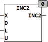

<!--
  Copyright (c) 2026 Hans Mühlbauer, Franz Höpfinger and others.

  This program and the accompanying materials are made available under the
  terms of the Eclipse Public License 2.0 which is available at
  https://www.eclipse.org/legal/epl-2.0

  SPDX-License-Identifier: EPL-2.0
-->

## Type	Funktion : INT

| | |
|:---|:---|
| **Input	X** | INT (Eingangswert) |
| **D** | INT (Wert, der zum Eingangswert addiert wird) |
| **L** | INT (unterer Grenzwert) |
| **U** | INT (oberer Grenzwert) |
| **Output** | INT (Ausgangswert) |
| | INC2 addiert zum Eingang X den Wert D und stellt sicher, dass der Ausgang INC nicht über den Wert U (oberer Grenzwert) oder unter den Wert L (unterer Grenzwert) läuft. Ist das Ergebnis aus der Addition von X und D größer als U so wird wieder bei L begonnen, Bei negativen D wird sichergestellt das bei Erreichen von L wieder bei U weiter gezählt wird. Die Funktion ist vor allem Sinnvoll beim adressieren von Arrays und Pufferspeichern. Auch beim Positionieren von Absolutwert Winkelgebern kann sie eingesetzt werden. INC2 kann auch mit einem negativen D zum decrementieren benutzt werden, dabei stellt INC2 sicher dass das Ergebnis nicht unter L läuft. |
| **INC2** | = X + D, wobei L <= INC2 <= U gilt. |



**Beispiel:**

```iecst
INC2(2, 2, -1, 3) ergibt -1 INC2(2, -2, -1, 3) ergibt 0 INC2(2, 1, -1, 3) ergibt 3 INC2(0, -2, -1, 3) ergibt 3
```
