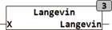

<!--
  Copyright (c) 2026 Hans Mühlbauer, Franz Höpfinger and others.

  This program and the accompanying materials are made available under the
  terms of the Eclipse Public License 2.0 which is available at
  https://www.eclipse.org/legal/epl-2.0

  SPDX-License-Identifier: EPL-2.0
-->

## LANGEVIN

| | |
|:---|:---|
| **Type	Funktion** | REAL |
| **Input	X** | REAL (Eingangswert) |
| **Output** | REAL (Ausgangswert) |
| | Die Langevin Funktion ist der Sigmoidfunktion sehr ähnlich, nähert sich aber langsamer den Grenzwerten an. Im Gegensatz zur Sigmoidfunktion  liegen die Grenzwerte bei -1 und +1. Die Langevin Funktion ist vor allem auf CPUs ohne Gleitkommaeinheit deutlich schneller als die Sigmoidfunktion. |
| **Die folgende Grafik verdeutlicht den Verlauf der Langevin Funktion** |  |

