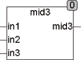

<!--
  Copyright (c) 2026 Hans Mühlbauer, Franz Höpfinger and others.

  This program and the accompanying materials are made available under the
  terms of the Eclipse Public License 2.0 which is available at
  https://www.eclipse.org/legal/epl-2.0

  SPDX-License-Identifier: EPL-2.0
-->

## MID3

| | |
|:---|:---|
| **Type	Funktion** | REAL |
| **Input	IN1** | REAL (Eingang 1) |
| **IN2** | REAL (Eingang 2) |
| **IN3** | REAL (Eingang 3) |
| **Output** | REAL (Mittlerer Wert der 3 Eingänge) |
| | Die Funktion MID3 liefert den mittleren Wert von 3 Eingängen, nicht aber den Mathematischen Mittelwert. |



**Beispiel:**

```iecst
MID3(1,5,2) = 2.
```
