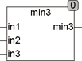

<!--
  Copyright (c) 2026 Hans Mühlbauer, Franz Höpfinger and others.

  This program and the accompanying materials are made available under the
  terms of the Eclipse Public License 2.0 which is available at
  https://www.eclipse.org/legal/epl-2.0

  SPDX-License-Identifier: EPL-2.0
-->

## MIN3

| | |
|:---|:---|
| **Type	Funktion** | REAL |
| **Input	IN1** | REAL (Eingang 1) |
| **IN2** | REAL (Eingang 2) |
| **IN3** | REAL (Eingang 3) |
| **Output** | REAL (Minimalwert der 3 Eingänge) |
| | Die Funktion MIN3 liefert den Minimalwert von 3 Eingängen. Grundsätzlich sollte die im Standard Funktionsumfang nach IEC61131-3 enthaltene Funktion MIN mit einer variablen Anzahl von Eingängen ausgestattet sein. Da aber in einigen Systemen  die Funktion MIN nur 2 Eingänge unterstützt wird die Funktion MIN3 angeboten. |



**Beispiel:**

```iecst
MIN3(1,3,2) = 1.
```
