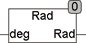

<!--
  Copyright (c) 2026 Hans Mühlbauer, Franz Höpfinger and others.

  This program and the accompanying materials are made available under the
  terms of the Eclipse Public License 2.0 which is available at
  https://www.eclipse.org/legal/epl-2.0

  SPDX-License-Identifier: EPL-2.0
-->

## RAD

| | |
|:---|:---|
| **Type	Funktion** | REAL |
| **Input	DEG** | REAL (Winkel in Grad) |
| **Output** | REAL (Winkel in Bogenmaß) |
| | Die Funktion RAD konvertiert einen Winkelwert von Grad in Bogenmaß. Dabei wird berücksichtigt das DEG nicht größer als 360 sein darf. Wenn DEG größer als 360 ist wird solange 360 abgezogen bis DEG zwischen 0 und 360 liegt. |
| **RAD(0) = 0** | RAD(180) = π RAD(360) = 0	RAD(540) = π |

