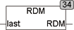

<!--
  Copyright (c) 2026 Hans Mühlbauer, Franz Höpfinger and others.

  This program and the accompanying materials are made available under the
  terms of the Eclipse Public License 2.0 which is available at
  https://www.eclipse.org/legal/epl-2.0

  SPDX-License-Identifier: EPL-2.0
-->

## RDM

| | |
|:---|:---|
| **Type	Funktion** | REAL |
| **Input	LAST** | REAL (Letzter berechneter Wert) |
| **Output** | REAL (Zufallszahl zwischen 0 und 1) |
| | RDM berechnet eine Pseudo-Zufallszahl. Dazu wird der SPS-interne Timer ausgelesen und in eine Pseudo-Zufallszahl überführt. Da RDM als Funktion und nicht als Funktionsbaustein geschrieben wurde, kann es keine Daten zwischen 2 Aufrufen speichern und muss deshalb mit Vorsicht angewendet werden. Wird RDM nur einmal je Zyklus aufgerufen, liefert sie hinreichend gute Zahlen. Wird sie aber mehrfach innerhalb eines Zyklus aufgerufen, so liefert sie dieselbe Zahl, weil höchstwahrscheinlich der SPS Timer noch auf demselben Wert steht. Wird die Funktion mehrfach innerhalb eines Zyklus benötigt, so muss ihr bei jedem Aufruf eine unterschiedliche Startzahl (LAST) übergeben werden. Wird Sie hingegen nur einmal je Zyklus aufgerufen, genügt der Aufruf RDM(0). Als Startzahl kann bei jedem Aufruf die letzte ermittelte Zahl von RDM verwendet werden. Die von RDM gelieferten Zufallszahlen liegen zwischen 0 und 1, die 1 nicht enthalten (0 <= Zufallszahl < 1. |

