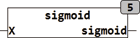
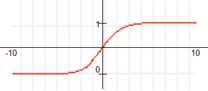

<!--
  Copyright (c) 2026 Hans Mühlbauer, Franz Höpfinger and others.

  This program and the accompanying materials are made available under the
  terms of the Eclipse Public License 2.0 which is available at
  https://www.eclipse.org/legal/epl-2.0

  SPDX-License-Identifier: EPL-2.0
-->

## Type	Funktion : INT

| | |
|:---|:---|
| **Input	X** | REAL (Eingangswert) |
| **Output** | REAL (Ergebnis der Sigmoidfunktion) |
| **Die Sigmoidfunktion wird auch Schwanenhals- Funktion genannt und wird durch die folgende Gleichung beschrieben** |  |
| | SIGMOID = 1 / (1 + EXP(-X)) |
| | Die Sigmoidfunktion wird häufig als Aktivierungsfunktion verwendet. Durch seinen Verlauf eignet sich die Sigmoidfunktion für weiche Schaltübergänge. |
| **Die folgende Grafik veranschaulicht den Verlauf der Sigmoidfunktion** |  |

