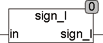

<!--
  Copyright (c) 2026 Hans Mühlbauer, Franz Höpfinger and others.

  This program and the accompanying materials are made available under the
  terms of the Eclipse Public License 2.0 which is available at
  https://www.eclipse.org/legal/epl-2.0

  SPDX-License-Identifier: EPL-2.0
-->

## Type	Funktion : BOOL

| | |
|:---|:---|
| **Input	IN** | DINT (Eingangswert) |
| **Output** | BOOL (TRUE, wenn der Eingang negativ ist) |
| | Die Funktion SIGN_I liefert TRUE zurück, wenn der Eingangswert negativ ist. Die Eingangswerte sind vom Typ DINT. |

