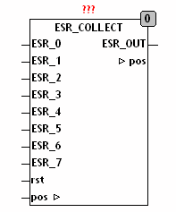

<!--
  Copyright (c) 2026 Hans Mühlbauer, Franz Höpfinger and others.

  This program and the accompanying materials are made available under the
  terms of the Eclipse Public License 2.0 which is available at
  https://www.eclipse.org/legal/epl-2.0

  SPDX-License-Identifier: EPL-2.0
-->

## ESR_COLLECT

| | |
|:---|:---|
| **Type** | Funktionsbaustein |
| **Input	ESR_0..7** | [ESR_DATA](../Data Types/esr_data.md) (ESR_Eingänge) |
| **RST** | BOOL (Asynchroner Reset Eingang) |
| **Output	ESR_OUT** | [ESR_DATA](../Data Types/esr_data.md) (Array mit dem ESR-Protokoll) |
| **IN/OUT	POS** | INT (Position des neusten ESR Protokolls im Array) |
| | ESR_COLLECT sammelt ESR-Daten von bis zu 8 ESR-Bausteinen und speichert das Protokoll in einem Array. Der Ausgang POS zeigt an, an welcher Position des Arrays ESR_OUT sich die momentan letzte ESR-Meldung befindet. Sammelt der Baustein mehr als 64 Meldungen, so werden die Meldungen verworfen und bei Position 0 neu begonnen. Mit dem Asynchronen Reset Eingang kann der Baustein jederzeit zurückgesetzt werden. Durch einen Reset werden alle gesammelten Reset Daten gelöscht und der Positionszeiger auf -1 gestellt. Der Baustein sammelt Daten im Ausgangsarray ESR_OUT und setzt POS auf die letzte aktuelle Position des Arrays die Daten enthält. Wenn keine Meldungen anstehen bleibt POS auf -1. Werden die Ausgangsdaten ausgelesen, muss die Variable POS auf -1 gesetzt werden, oder falls nur teilweise ausgelesen wird kann POS auf den letzten gültigen Wert gesetzt werden. |
| | Das folgende Beispiel demonstriert, wie ESR_COLLECT mit ESR-Bausteinen zusammen geschaltet wird. |
| **Der Ausgang ESR_OUT setzt sich wie folgt zusammen** |  |
| **Die ESR Daten enthalten folgende Informationen** |  |
| **[ESR_DATA](../Data Types/esr_data.md) .TYP** | Datentyp siehe vorstehende Tabelle |
| **[ESR_DATA](../Data Types/esr_data.md) .ADRESS** | bis zu 10 Zeichen langer String Bezeichner |
| **[ESR_DATA](../Data Types/esr_data.md) .DS** | Datums Stempel von Typ DATATIME |
| **[ESR_DATA](../Data Types/esr_data.md) .TS** | Zeitstempel vom Typ TIME (SPS Timer) |
| **[ESR_DATA](../Data Types/esr_data.md) .DATA** | bis zu 8 Byte Datenblock |

| .TYP | .ADRESS | .DS | .TS | .DATA[0..7] |  |
| --- | --- | --- | --- | --- | --- |
| 1 | Label | Date | TIME | Status, 1 Byte | ESR Error |
| 2 | Label | Date | TIME | Status, 1 Byte | ESR Status |
| 3 | Label | Date | TIME | Status, 1 Byte | ESR Debug |
| 10 | Label | Date | TIME | notused | Boolean input lowtransition |
| 11 | Label | Date | TIME | notused | Boolean input hightransition |
| 20 | Label | Date | TIME | Byte 0 - 3 Real Value | Real Valuechange |
