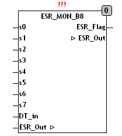

<!--
  Copyright (c) 2026 Hans Mühlbauer, Franz Höpfinger and others.

  This program and the accompanying materials are made available under the
  terms of the Eclipse Public License 2.0 which is available at
  https://www.eclipse.org/legal/epl-2.0

  SPDX-License-Identifier: EPL-2.0
-->

## ESR_MON_B8

| | |
|:---|:---|
| **Type** | Funktionsbaustein |
| **Input	S0..7** | BOOL (Signaleingänge) |
| **DT_IN** | DATE_TIME (Zeit- Datum-Eingang für Zeitstempel) |
| **Output	ESR_FLAG** | BOOL (TRUE, wenn ESR-Daten vorhanden sind) |
| **IN/OUT	ESR_OUT** | ESR_Data (ESR_Datenausgang) |
| **Setup	A0..7** | STRING(10) (Bezeichnung der Eingänge) |
| | ESR_MON_B8 überwacht bis zu 8 Binäre Signale auf Änderungen, und versieht sie mit einem Zeitstempel und einer Bezeichnung. Die gesammelten Meldungen werden gepuffert und an einen Protokollbaustein über ESR_OUT weitergereicht. Der Ausgang ESR_FLAG wird auf TRUE gesetzt, wenn Meldungen vorhanden sind. |
| **Die ESR-Daten am Ausgang setzen sich wie folgt zusammen** |  |
| **.TYP** | 11 steigendeFlanke, 10 fallendeFlanke |
| **.ADRESS** | Adresse Byte der ESR-Datenaufzeichnung |
| **.LINE** | Liniennummer (Eingang) der ESR-Datenaufzeichnung |
| **.DS** | Datumsstempel vom Typ DATE_TIME |
| **.DT** | Zeitstempel vom Typ TIME (SPS-Timer) |
| **.Data** | Datenblock von 8 Byte unbelegt |
| | Ein Anwendungsbeispiel für den Baustein befindet sich in der Beschreibung von ESR_COLLECT. |

