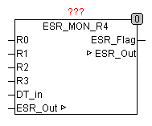

<!--
  Copyright (c) 2026 Hans Mühlbauer, Franz Höpfinger and others.

  This program and the accompanying materials are made available under the
  terms of the Eclipse Public License 2.0 which is available at
  https://www.eclipse.org/legal/epl-2.0

  SPDX-License-Identifier: EPL-2.0
-->

## ESR_MON_R4

| | |
|:---|:---|
| **Type** | Funktionsbaustein |
| **Input	R0..3** | REAL (Signaleingänge) |
| **DT_IN** | DATE_TIME (Zeit- Datum-Eingang für Zeitstempel) |
| **Output	ESR_FLAG** | BOOL (TRUE, wenn ESR-Daten vorhanden sind) |
| **IN/OUT	ESR_OUT** | ESR_Data (ESR_Datenausgang) |
| **Setup	A0..3** | STRING(10) (Signaladresse der Eingänge) |
| **S0..3** | REAL (Schwellenwerte für Signaländerung) |
| | ESR_MON_R4 überwacht bis zu 4 Analoge Signale auf Änderungen und versieht sie mit einem Zeitstempel und der Signaladresse des entsprechenden Eingangs. Die gesammelten Meldungen werden gepuffert und an einen Protokollbaustein über ESR_OUT weitergereicht. Der Ausgang ESR_FLAG wird auf TRUE gesetzt, wenn Meldungen vorhanden sind. Eine Änderung eines Eingangs wird nur dann aufgezeichnet, wenn sich der Eingang um mehr als durch den Schwellenwert S vorgegebenen Wert geändert hat. |
| **.TYP** | 20Gleitpunktwert |
| **.ADRESS** | Adresse Byte der ESR-Datenaufzeichnung |
| **.LINE** | Liniennummer (Eingang) der ESR-Datenaufzeichnung |
| **.DS** | Datumsstempel vom Typ DATE_TIME |
| **.DT** | Zeitstempel vom Typ TIME (SPS-Timer) |
| **.Data** | Datenblock 4 Byte Real Wert |
| | Ein Anwendungsbeispiel für den Baustein befindet sich in der Beschreibung von ESR_COLLECT. |

