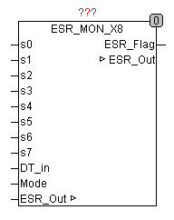

<!--
  Copyright (c) 2026 Hans Mühlbauer, Franz Höpfinger and others.

  This program and the accompanying materials are made available under the
  terms of the Eclipse Public License 2.0 which is available at
  https://www.eclipse.org/legal/epl-2.0

  SPDX-License-Identifier: EPL-2.0
-->

## ESR_MON_X8

| | |
|:---|:---|
| **Type** | Funktionsbaustein |
| **Input	S0..7** | Byte (Status Eingänge) |
| **DT_IN** | DATE_TIME (Zeit-Datum-Eingang für Zeitstempel) |
| **Mode** | Byte (legt die zu verarbeitende Art von Meldungen fest) |
| **Output	ESR_FLAG** | BOOL (TRUE, wenn Meldungen vorhanden sind) |
| **IN/OUT	ESR_OUT** | Array[0..7] of [ESR_DATA](../Data Types/esr_data.md) (gesammelte Meldungen) |
| **Setup	A0..7** | STRING(10) (Signaladresse der Eingänge) |
| | ESR_MON_X8 sammelt Status-Meldungen von bis zu 8 ESR kompatiblen Bausteinen ein, versieht sie mit einem Zeitstempel, Datumsstempel, Eingangsnummer und einer Bausteinadresse. Die gesammelten Meldungen werden gepuffert und an einen Protokollbaustein weitergereicht. Wenn Meldungen zur Weitergabe vorhanden sind, wird dies mit dem Signal ESR_FLAG signalisiert. AM Eingang DT_IN sollte die aktuelle Uhrzeit, die für den Zeitstempel der Meldungen dient anliegen. Der Eingang MODE legt fest, welche Statusmeldungen weitergereicht werden sollen. |
| | Wenn der Eingang MODE nicht beschaltet wird, werden automatisch alle Meldungen verarbeitet. |
| **Die ESR-Daten am Ausgang setzen sich wie folgt zusammen** | .TYP	1=Fehler, 2=Status, 3=Debug .ADRESS	Adresse Byte der ESR-Datenaufzeichnung .LINE	Liniennummer (Eingang) der ESR-Datenaufzeichnung .DS	Datumsstempel vom Typ DATE_TIME .DT	Zeitstempel vom Typ TIME (SPS-Timer) .Data	Data Byte 0 enthält die Statusmeldung |

| | Ein Anwendungsbeispiel für den Baustein befindet sich in der Beschreibung von ESR_COLLECT. |

