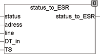

<!--
  Copyright (c) 2026 Hans Mühlbauer, Franz Höpfinger and others.

  This program and the accompanying materials are made available under the
  terms of the Eclipse Public License 2.0 which is available at
  https://www.eclipse.org/legal/epl-2.0

  SPDX-License-Identifier: EPL-2.0
-->

## STATUS_TO_ESR

| | |
|:---|:---|
| **Type	Funktion** | [ESR_DATA](../Data Types/esr_data.md) |
| **Input	STATUS** | BYTE (Status Byte) |
| **ADRESS** | Byte (Adresse, Byte) |
| **LINE** | Byte (Eingangsnummer) |
| **DT_IN** | DATE_TIME (Zeit-Datum-Eingang) |
| **TS** | TIME (Zeit für Zeitstempel) |
| **Output** | [ESR_DATA](../Data Types/esr_data.md) (ESR-Datenblock) |
| | STATUS_TO_ESR erzeugt einen ESR Datensatz aus den Eingangswerten. |
| | Ein STATUS im Bereich zwischen 1 .. 99 ist eine Fehlermeldung und wird als Typ 1 gekennzeichnet. Status 100 .. 199 wird als Typ 2 gekennzeichnet und 200 .. 255 wird als Typ 3 gekennzeichnet (Debug-Information). |
| **Die ESR-Daten am Ausgang setzen sich wie folgt zusammen** |  |
| **.TYP** | 1=Fehler, 2=Status, 3=Debug |
| **.ADRESS** | Adresse Byte der ESR-Datenaufzeichnung |
| **.LINE** | Liniennummer (Eingang) der ESR-Datenaufzeichnung |
| **.DS** | Datumsstempel vom Typ DATE_TIME |
| **.DT** | Zeitstempel vom Typ TIME (SPS-Timer) |
| **.Data** | Datenblock von 8 Byte |

