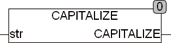

<!--
  Copyright (c) 2026 Hans Mühlbauer, Franz Höpfinger and others.

  This program and the accompanying materials are made available under the
  terms of the Eclipse Public License 2.0 which is available at
  https://www.eclipse.org/legal/epl-2.0

  SPDX-License-Identifier: EPL-2.0
-->

## CAPITALIZE

| | |
|:---|:---|
| **Type	Funktion** | STRING |
| **Input	STR** | STRING (Eingangsstring) |
| **Output** | STRING (Ergebnis STRING) |
| | CAPITALIZE setzt alle Anfangsbuchstaben in STR auf Großbuchstaben. Bei der Konvertierung wird die Globale Setup Konstante EXTENDED_ASCII berücksichtigt. Wenn EXTENDED_ASCII = TRUE werden Zeichen des erweiterten ASCII Zeichensatzes nach ISO 8859-1 berücksichtigt. |
| | CAPITALIZE('hugo wallenstein') = 'Hugo Wallenstein' |

