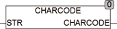

<!--
  Copyright (c) 2026 Hans Mühlbauer, Franz Höpfinger and others.

  This program and the accompanying materials are made available under the
  terms of the Eclipse Public License 2.0 which is available at
  https://www.eclipse.org/legal/epl-2.0

  SPDX-License-Identifier: EPL-2.0
-->

## Type	Funktion : BYTE

| | |
|:---|:---|
| **Input	STR** | STRING(10) (Eingangsstring) |
| **Output** | BYTE (Zeichencode) |
| | CHARCODE liefert den Byte Code eines NamedCharacters. EineListeder Codes mitNamenbefindet sich unter der Funktion CHARNAME. Falls für den Namen in STR keine Zeichenname bekannt ist wird 0 zurückgegeben. Besteht STR nur aus einem Zeichen, so wird der Code dieses Zeichens  zurückgegeben. CHARCODE benutzt die globalen Variablen SETUP.CHARNAMES die die Liste der Namen mit Codes enthalten. |



**Beispiel:**

```iecst
CHARCODE('euro') = 128 und entspricht dem Zeichen € CHARCODE(',') = 44
```
