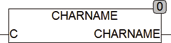

<!--
  Copyright (c) 2026 Hans Mühlbauer, Franz Höpfinger and others.

  This program and the accompanying materials are made available under the
  terms of the Eclipse Public License 2.0 which is available at
  https://www.eclipse.org/legal/epl-2.0

  SPDX-License-Identifier: EPL-2.0
-->

## CHARNAME

| | |
|:---|:---|
| **Type	Funktion** | STRING(10) |
| **Input	C** | BYTE (Zeichencode) |
| **Output** | STRING (Zeichenname) |
| | CHARNAME ermittelt den Zeichennamen für einen Zeichencode. |



**Beispiel:**

```iecst
CHARNAME(128) = 'euro'
```

Falls für einen Code kein Name bekannt ist wird der Code als einzelnes Zeichen zurückgegeben. Für den Code 0 wird eine leere Zeichenkette zurückgegeben. CHARCODE benutzt die globalen Variablen SETUP.CHARNAMES die die Liste der Namen mit Codes enthalten.
