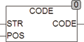

<!--
  Copyright (c) 2026 Hans Mühlbauer, Franz Höpfinger and others.

  This program and the accompanying materials are made available under the
  terms of the Eclipse Public License 2.0 which is available at
  https://www.eclipse.org/legal/epl-2.0

  SPDX-License-Identifier: EPL-2.0
-->

## Type	Funktion : BYTE

| | |
|:---|:---|
| **Input	STR** | STRING (Zeichenkette) |
| **POS** | INT (Position an der das Zeichen gelesen wird) |
| **Output** | BYTE (Code des Zeichens an der Position POS) |
| | CODE ermittelt den Numerischen Code eines Zeichens an der Stelle POS in STR. wird CODE mit einer Position kleiner 1 oder größer der Länge von STR aufgerufen wird 0 zurückgegeben. |



**Beispiel:**

```iecst
CODE('ABC 123',4) = 32
```

(Das Zeichen ' ' wird mit dem Wert 32 kodiert.
