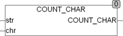

<!--
  Copyright (c) 2026 Hans Mühlbauer, Franz Höpfinger and others.

  This program and the accompanying materials are made available under the
  terms of the Eclipse Public License 2.0 which is available at
  https://www.eclipse.org/legal/epl-2.0

  SPDX-License-Identifier: EPL-2.0
-->

## Type	Funktion : STRING

| | |
|:---|:---|
| **Input	STR** | STRING (Zeichenkette) |
| **CHR** | Byte (Suchzeichen) |
| **Output** | STRING (Ergebnis STRING) |
| | COUNT_CHAR ermittelt wie oft das Zeichen CHR in der Zeichenkette STR vorkommt. Um auch nach Sonderzeichen und Steuerzeichen suchen zu können wird das Suchzeichen CHR als BYTE angegeben. |

