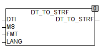

<!--
  Copyright (c) 2026 Hans Mühlbauer, Franz Höpfinger and others.

  This program and the accompanying materials are made available under the
  terms of the Eclipse Public License 2.0 which is available at
  https://www.eclipse.org/legal/epl-2.0

  SPDX-License-Identifier: EPL-2.0
-->

## DT_TO_STRF

| | |
|:---|:---|
| **Type	Funktion** | STRING |
| **Input	DTI** | DT (Datum und Zeit Eingangswert) |
| **MS** | INT (Millisekunden Eingang) |
| **FMT** | STRING (Vorgabe für Ausgangs Format) |
| **LANG** | INT (Sprachvorgabe) |
| **Output** | STRING (Ergebnis String) |
| | DT_TO_STRF konvertiert einen DATETIME Wert in eine formatierte Zeichenkette. Am Eingang DTI liegt der zu konvertierende DATETIME Wert an und mit der Zeichenkette FMT wird das entsprechende Ausgangsformat bestimmt. Der Eingang LANG bestimmt dabei die zu benutzende Sprache (0= LANGUAGE_DEFAULT, 1= Englisch und 2 = Deutsch). Die Spracheinstellungen werden im entsprechenden Absatz der Globalen Konstanten vorgenommen und können dort angepasst oder Erweitert werden. Zusätzlich zu Datum und Zeit können am Eingang MS auch Millisekunden verarbeitet werden. |
| **Die erzeugte Zeichenkette entspricht der Zeichenkette FMT wobei in der Zeichenkette alle Zeichen '#' gefolgt von einem Großbuchstaben mit dem entsprechenden Wert ersetzt werden. Die folgende Tabelle definiert die Formatierungszeichen** |  |



**Beispiel:**

```iecst
DT_TO_STRF(DT#2008-1-1, 'Datum '#C. #F #A', 2) = '1. Januar 2008' DT_TO_STRF(DT#2008-1-1-13:43:12, '#J #M:#Q am #C. #E #A', 2) = 'Di 13:43 am 1. Jan 2008'
```

| #A | Jahreszahl mit 4 Stellen (2008) |
| --- | --- |
| #B | Jahreszahl 2-Stellig z.B. (08) |
| #C | Monat 1-2 Stellig (1,12) |
| #D | Monat 2 Stellig (01, 12) |
| #E | Monat 3 Buchstaben (Jan) |
| #F | Monat ausgeschrieben (Januar) |
| #G | Tag 1 oder 2 stellig (1, 31) |
| #H | Tag 2 Stellig (01, 31) |
| #I | Wochentag als Zahl (1 = Montag, 7= Sonntag) |
| #J | Wochentag 2 Buchstaben (Mo) |
| #K | Wochentag ausgeschrieben (Montag) |
| #L | AM oder PM für Amerikanische Datumsformate |
| #M | Stunde in 24 Stunden Format 1 - 2 Stellig (0, 23) |
| #N | Stunde in 24 Stunden Format 2 Stellig (00, 23) |
| #O | Stunde in 12 Stunden Format 1 - 2 Stellig (1, 12) |
| #P | Stunde in 12 Stunden Format 2 Stellig (01, 12) |
| #Q | Minuten 1 - 2 Stellig (0, 59) |
| #R | Minuten 2 Stellig (00, 59) |
| #S | Sekunden 1 - 2 Stellig (0, 59) |
| #T | Sekunden 2 Stellig (00, 59) |
| #U | Millisekunden 1 - 3 Stellig (0, 999) |
| #V | Millisekunden 3 Stellig (000, 999) |
| #W | Tag 2 Stellig aber vorne mit Blank aufgefüllt (' 1' ..'31') |
| #X | Monat 2 Stellig aber vorne mit Blank aufgefüllt (' 1' ..'12') |
