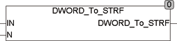

<!--
  Copyright (c) 2026 Hans Mühlbauer, Franz Höpfinger and others.

  This program and the accompanying materials are made available under the
  terms of the Eclipse Public License 2.0 which is available at
  https://www.eclipse.org/legal/epl-2.0

  SPDX-License-Identifier: EPL-2.0
-->

## Type	Funktion : STRING

| | |
|:---|:---|
| **Input	IN** | DWORD (Eingangswert) |
| **N** | Int (Länge des Ergebnis Strings) |
| **Output** | STRING (Ergebnis String) |
| | DWORD_TO_STRF konvertiert ein DWORD, Word oder Byte in einen STRING fester Länge. Der Ausgangsstring ist exakt N Stellen lang, wobei führende Nullen eingefügt werden oder führende Stellen abgeschnitten werden. Die maximale erlaubte Länge N ist 20 Digits. |



**Beispiel:**

```iecst
DWORD_TO_STRF(5123, 6) = '005123'
```
```iecst
DWORD_TO_STRF(5123, 3) = '123'
```
