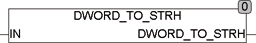

<!--
  Copyright (c) 2026 Hans Mühlbauer, Franz Höpfinger and others.

  This program and the accompanying materials are made available under the
  terms of the Eclipse Public License 2.0 which is available at
  https://www.eclipse.org/legal/epl-2.0

  SPDX-License-Identifier: EPL-2.0
-->

## Type	Funktion : STRING

| | |
|:---|:---|
| **Input	IN** | DWORD (Eingangswert) |
| **Output** | STRING(8) (Ergebnis String) |
| | DWORD_TO_STRH konvertiert ein DWORD, Word oder Byte in einen STRING fester Länge. Der Ausgangsstring ist exakt 8 Stellen lang und entspricht der hexadezimalen Schreibweise des Wertes IN. Der Ausgangsstring besteht aus den Zeichen '0' .. '1' und 'A' .. 'F'. Das niederwertigste Hexadezimal-Zeichen steht rechts im STRING. DWORD_TO_STRH kann als Input Byte, Word und DWORD Typen verarbeiten. Der Ausgang ist aber unabhängig vom Eingangstyp immer ein STRING mit 32 Zeichen. Falls ein kürzerer STRING benötigt wird, kann dieser mit der Standardfunktion RIGHT() entsprechend abgeschnitten werden. Der Aufruf RIGHT(DWORD_TO_STRH(X),4) ergibt einen STRING mit 4 Zeichen die dem Inhalt der untersten 2 Bytes von X entsprechen. |



**Beispiel:**

```iecst
DWORD_TO_STRH(127) = '0000007F'
```
