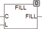

<!--
  Copyright (c) 2026 Hans Mühlbauer, Franz Höpfinger and others.

  This program and the accompanying materials are made available under the
  terms of the Eclipse Public License 2.0 which is available at
  https://www.eclipse.org/legal/epl-2.0

  SPDX-License-Identifier: EPL-2.0
-->

## Type	Funktion : STRING

| | |
|:---|:---|
| **Input	C** | BYTE (Character Code) |
| **L** | INT (Länge der Zeichenkette) |
| **Output** | STRING (Ergebnis STRING) |
| | FILL erzeugt eine Zeichenkette bestehend aus dem Zeichen C mit der Länge L. |
| | FILL(49,5) = '11111' |
| | Die Funktion FILL wertet auch die Globale Setup Konstante STRING_LENGTH aus und begrenzt die maximale Länge L der Zeichenkette auf STRING_LENGTH. |

