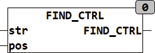

<!--
  Copyright (c) 2026 Hans Mühlbauer, Franz Höpfinger and others.

  This program and the accompanying materials are made available under the
  terms of the Eclipse Public License 2.0 which is available at
  https://www.eclipse.org/legal/epl-2.0

  SPDX-License-Identifier: EPL-2.0
-->

## Type	Funktion : INT

| | |
|:---|:---|
| **Input	STR** | STRING (Eingabe STRING) |
| **POS** | INT (Startposition) |
| **Output** | INT (Position des ersten Zeichens das ein Steuerzeichen ist) |
| | FIND_CTRL durchsucht die Zeichenkette STR ab der Position POS und gibt die Position zurück an der das nächste Steuerzeichen steht. Steuerzeichen sind alle Zeichen deren Wert kleiner 32 oder 127 ist. |

