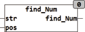

<!--
  Copyright (c) 2026 Hans Mühlbauer, Franz Höpfinger and others.

  This program and the accompanying materials are made available under the
  terms of the Eclipse Public License 2.0 which is available at
  https://www.eclipse.org/legal/epl-2.0

  SPDX-License-Identifier: EPL-2.0
-->

## Type	Funktion : INT

| | |
|:---|:---|
| **Input	STR** | STRING (Eingabestring) |
| **POS** | INT (Position an der die Suche beginnt) |
| **Output** | INT (Position des ersten Zeichens, das eine Zahl oder Punkt ist) |
| | Die Funktion FIND_NUM durchsucht STR ab der Position POS von links nach rechts und liefert die erste Stelle die eine Nummer ist zurück. |
| | Nummern sind die Buchstaben "0..9" und "." |



**Beispiel:**

```iecst
FIND_NONUM('4+33',1) = 1
```
