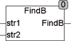

<!--
  Copyright (c) 2026 Hans Mühlbauer, Franz Höpfinger and others.

  This program and the accompanying materials are made available under the
  terms of the Eclipse Public License 2.0 which is available at
  https://www.eclipse.org/legal/epl-2.0

  SPDX-License-Identifier: EPL-2.0
-->

## Type	Funktion : INT

| | |
|:---|:---|
| **Input	STR1** | STRING (Eingabestring) |
| **STR2** | STRING (Suchstring) |
| **Output** | INT (Position des letzten Vorkommens von STR2 in STR1) |
| | Die Funktion FINDB durchsucht STR1 auf das Vorkommen von STR2 und liefert die letzte Position von STR2 in STR1 zurück. |
| | Falls STR2 nicht gefunden wird, wird eine 0 zurückgegeben. |



**Beispiel:**

```iecst
FINDB('abs12fir12bus12', '12') = 14
```
