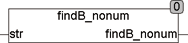

<!--
  Copyright (c) 2026 Hans Mühlbauer, Franz Höpfinger and others.

  This program and the accompanying materials are made available under the
  terms of the Eclipse Public License 2.0 which is available at
  https://www.eclipse.org/legal/epl-2.0

  SPDX-License-Identifier: EPL-2.0
-->

## Type	Funktion : INT

| | |
|:---|:---|
| **Input	STR** | STRING (Eingabestring) |
| **Output** | INT (Position des letzten Buchstaben, der keine Nummer ist) |
| | Die Funktion FINDB_NONUM durchsucht STR von rechts nach links und liefert die letzte Stelle die keine Nummer ist zurück. |
| | Nummern sind die Buchstaben "0..9" und ".". |



**Beispiel:**

```iecst
FINDB_NONUM('4+33+1') = 5
```
