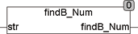

<!--
  Copyright (c) 2026 Hans Mühlbauer, Franz Höpfinger and others.

  This program and the accompanying materials are made available under the
  terms of the Eclipse Public License 2.0 which is available at
  https://www.eclipse.org/legal/epl-2.0

  SPDX-License-Identifier: EPL-2.0
-->

## Type	Funktion : INT

| | |
|:---|:---|
| **Input	STR** | STRING (Eingabestring) |
| **Output** | INT (Position des letzten Zeichens, das eine Zahl oder Punkt ist) |
| | Die Funktion FINDB_NUM durchsucht STR von Rechts nach links und liefert die letzte Stelle die eine Nummer ist. |
| | Nummern sind die Buchstaben "0..9" und ".". |



**Beispiel:**

```iecst
FINDB_NUM('4+33+1hh') = 6
```
